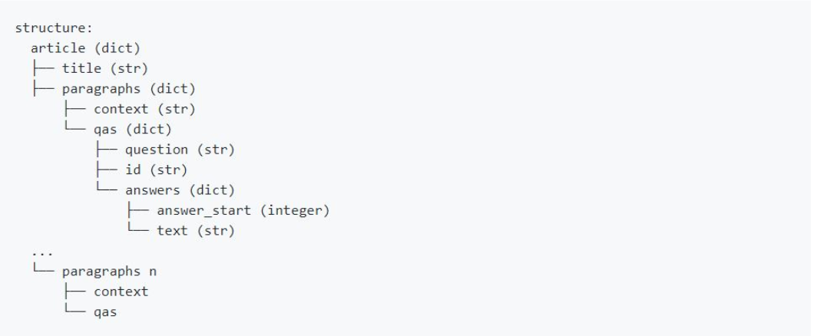

# Arabic Machine Reading Comprehension: Effective Models and Introducing Arabic-SQuAD v2.0

## Machine Reading Comprehension
Machine Reading Comprehension (MRC), or the ability to read and understand unstructured text and then answer questions about it remains a challenging task for computers. MRC is a growing field of research due to its potential in various enterprise applications, as well as the availability of MRC benchmarking datasets for latin languages (MSMARCO, SQuAD, NewsQA, etc.) except this dataset does not help arabic language thus lack of research and models in arabic language.
## What in This Repo?
This repository now contains code and implementation for:
- **AraElectra-Arabic-SQuADv2-QA**: Ouestion Answering model based on [AraElectra](https://huggingface.co/aubmindlab/araelectra-base-discriminator) trained on Arabic-SQuADv2.0 
- **AraElectra-Arabic-SQuADv2-CLS**: Classification model to predict if the questions can be answered in case of SQuADv2.0 based on [AraElectra](https://huggingface.co/aubmindlab/araelectra-base-discriminator) trained on Arabic-SQuADv2.0 
- **Arabic-SQuADv2.0**: New Arabic dataset based on SQuADv2.0 [Read More...](#Dataset)
## Hosted Interface

AraELECTRA-Arabic-SQuADv2-QA/CLS powered Arabic Wikipedia QA system with Streamlit

[](https://share.streamlit.io/zeyadahmed10/arabic-wikipedia-qa-streamlit/main/streamlit_app.py)
## Results
Model | Arabic-SQuADv2.0 (EM - F1) | 
|:----|:----:|
AraElectra-Arabic-SQuADv2-QA| **65.12** - **71.49** |
- New **state of the art** for arabic language on SQuADv2.0
- This results with the help of the classification model on the [last experiment](https://github.com/zeyadahmed10/Arabic-MRC/blob/main/AraElectraDecoupling-ASQuADv2.ipynb) 
  ### Reproduce Experiments
    - Install requirments 
    ```
    pip install requirments.txt
    ```
    - Run the desired notebook experiment to reproduce same results

## Models

 Model | HuggingFace Model Name | Size / Params|
 ---|:---:|:---:
 AraElectra-Arabic-SQuADv2-QA | [AraElectra-Arabic-SQuADv2-QA](https://huggingface.co/ZeyadAhmed/AraElectra-Arabic-SQuADv2-QA) | 514MB/134M |
 AraElectra-Arabic-SQuADv2-CLS| [AraElectra-Arabic-SQuADv2-CLS](https://huggingface.co/ZeyadAhmed/AraElectra-Arabic-SQuADv2-CLS) |  516MB/135M  
 
 ## Dataset and Compute

For Dataset Source see the [Dataset Section](#Dataset)

Model | Hardware | num of examples (seq len = dynamic len) | Batch Size | Num of epochs 
 ---|:---:|:---:|:---:|:---:
AraElectra-Arabic-SQuADv2-QA | Tesla K80 | 34.5K | 8 | 4 
AraElectra-Arabic-SQuADv2-CLS | Telsa K80 | 76.8K | 8 | 8

## Dataset
Introducing the new Arabic-SQuADV2.0 based on the popular SQuADv2.0 with unanswered questions for more challenging task. <br>
[Arabic-SQuADv2.0 on the huggingface](https://huggingface.co/datasets/ZeyadAhmed/Arabic-SQuADv2.0)
  ### Creation
  - A-NMT on Microsoft Azure Cognitive with state of the arts models on SQuADv2.0 train split
  - Data cleaning and drop uncontiguos span created by NMT
  - Preprocessing using the [Arabert Preprocessor](#Preprocessing)
  ### Size
  Train | Validation | Test 
  ---|:---:|:---:
 76.8K | 9.6K | 9.6K
  ### Structure 
  Arabic-SQuADv2.0 have same structure as SQuADv2.0 for consistency
  
  ## Preprocessing
[Arabert preprocessor](https://github.com/aub-mind/arabert/blob/master/preprocess.py) used for preocessing the dataset in creation and training/testing. <br>
It is recommended to apply the Arabert preprocessing function before training/testing on any dataset.

```python
from preprocess import ArabertPreprocessor

model_name = ""araelectra-base-discriminator"
arabert_prep = ArabertPreprocessor(model_name=model_name)

text = "ولن نبالغ إذا قلنا: إن 'هاتف' أو 'كمبيوتر المكتب' في زمننا هذا ضروري"
arabert_prep.preprocess(text)
```

You can also use the `unpreprocess()` function to reverse the preprocessing changes, by fixing the spacing around non alphabetical characters

### The `ArabertPreprocessor` class:

```python
ArabertPreprocessor(
  model_name= "",
  keep_emojis = False,
  remove_html_markup = True,
  replace_urls_emails_mentions = True,
  strip_tashkeel = True,
  strip_tatweel = True,
  insert_white_spaces = True,
  remove_non_digit_repetition = True,
  replace_slash_with_dash = None,
  map_hindi_numbers_to_arabic = None,
  apply_farasa_segmentation = None
)
```
## Usage on The HuggingFace
For best results use the AraBert preprocessor. <br>
```pip install transformers```
```python
from transformers import ElectraForQuestionAnswering, ElectraForSequenceClassification, AutoTokenizer, pipeline
from preprocess import ArabertPreprocessor
prep_object = ArabertPreprocessor("araelectra-base-discriminator")
question = prep_object('ما هي جامعة الدول العربية ؟')
context = prep_object('''
جامعة الدول العربية هيمنظمة إقليمية تضم دولاً عربية في آسيا وأفريقيا.
ينص ميثاقها على التنسيق بين الدول الأعضاء في الشؤون الاقتصادية، ومن ضمنها العلاقات التجارية الاتصالات، العلاقات الثقافية، الجنسيات ووثائق وأذونات السفر والعلاقات الاجتماعية والصحة. المقر الدائم لجامعة الدول العربية يقع في القاهرة، عاصمة مصر (تونس من 1979 إلى 1990). 
''')
# a) Get predictions
qa_modelname = 'ZeyadAhmed/AraElectra-Arabic-SQuADv2-QA'
cls_modelname = 'ZeyadAhmed/AraElectra-Arabic-SQuADv2-CLS'
qa_pipe = pipeline('question-answering', model=qa_modelname, tokenizer=qa_modelname)
QA_input = {
    'question': question,
    'context': context
}
CLS_input = {
    'text': question,
    'text_pair': context
}
qa_res = qa_pipe(QA_input)
cls_res = cls_pipe(CLS_iput)
threshold = 0.5 #hyperparameter can be tweaked
## note classification results label0 probability it can be answered label1 probability can't be answered 
## if label1 probability > threshold then consider the output of qa_res is empty string else take the qa_res
# b) Load model & tokenizer
qa_model = ElectraForQuestionAnswering.from_pretrained(qa_modelname)
cls_model = ElectraForSequenceClassification.from_pretrained(cls_modelname)
tokenizer = AutoTokenizer.from_pretrained(qa_modelname)
```

# Contacts
**Zeyad Ahmed**: [Linkedin](https://www.linkedin.com/in/zeyadahmed1/) |  [Github](https://github.com/zeyadahmed10) | zeyadahmed10101 (AT) gmail (DOT) com
